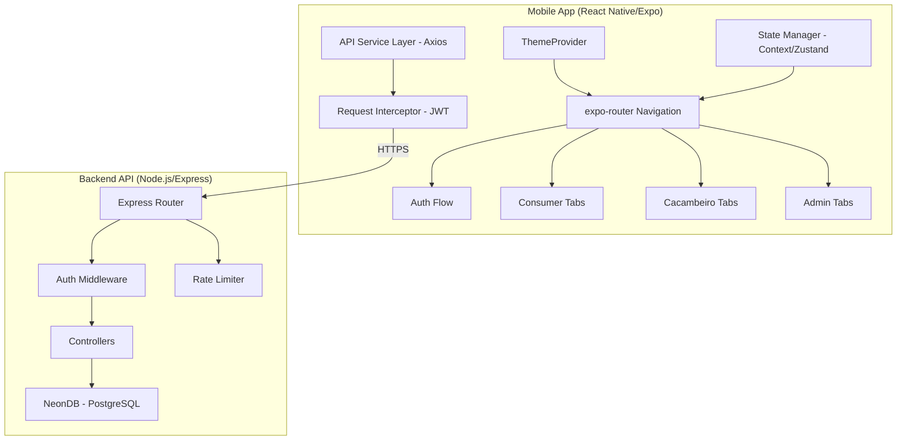
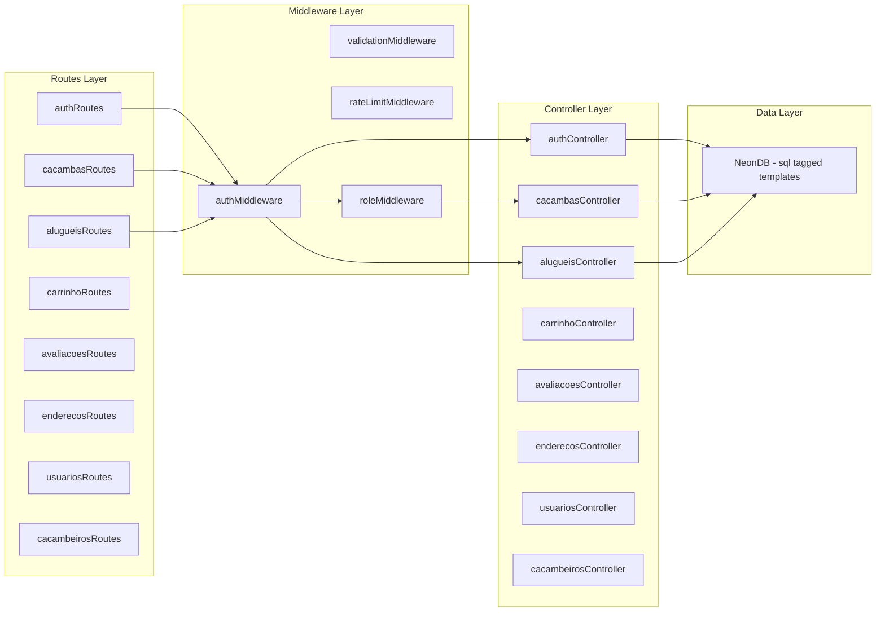
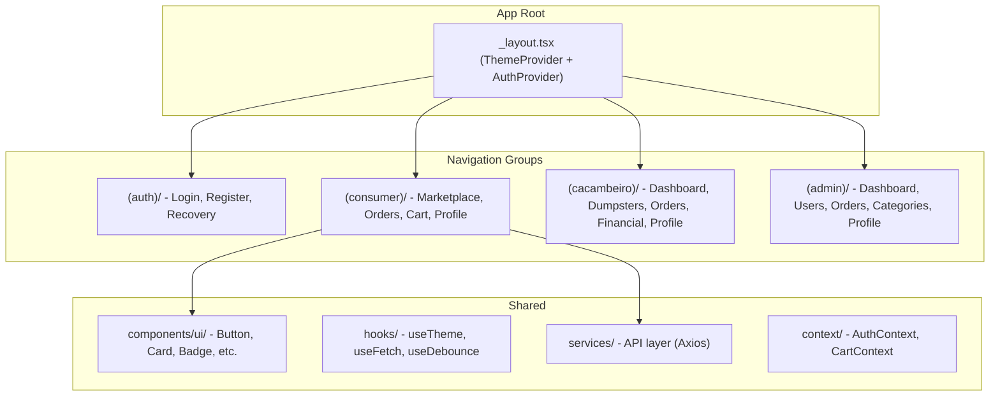
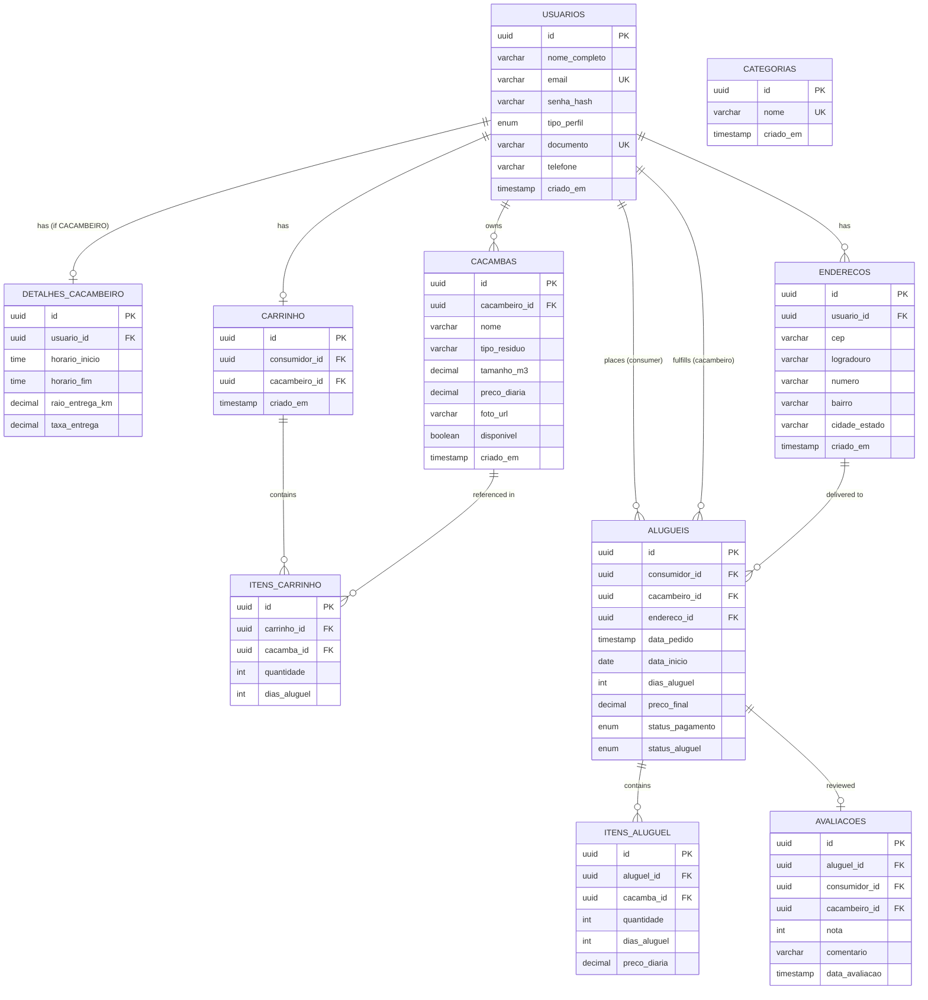
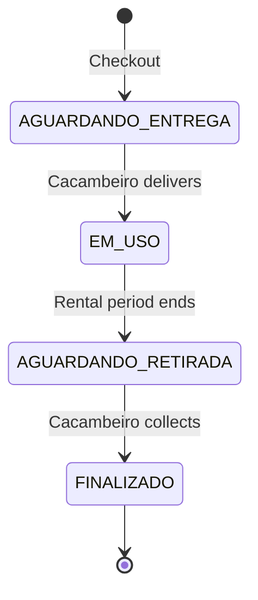

# Design Document: CollectExpress Marketplace

## Overview

CollectExpress is a marketplace platform for dumpster rentals ("iFood para caçambas") connecting consumers with caçambeiros (dumpster owners/operators), managed by an admin profile. The system is split into two applications:

- **CollectExpressAPI**: A Node.js/Express REST API using NeonDB (serverless PostgreSQL), bcryptjs for password hashing, and jsonwebtoken for JWT-based authentication.
- **CollectExpressAPP**: A React Native/Expo mobile application using expo-router for navigation, a centralized theme system (ThemeProvider/useTheme), and reusable UI components.

The platform supports three user profiles (CONSUMIDOR, CACAMBEIRO, ADMIN), each with distinct navigation flows, screens, and permissions. The architecture follows a client-server model where the mobile app communicates with the REST API via HTTP, with JWT tokens for authentication and role-based access control.

## Architecture

### High-Level Architecture



### Backend Architecture (Layered)



### Frontend Architecture (Feature-Based)



## Components and Interfaces

### Backend API Endpoints

| Group | Method | Endpoint | Auth | Role | Description |
|-------|--------|----------|------|------|-------------|
| Auth | POST | `/api/auth/register` | No | — | User registration |
| Auth | POST | `/api/auth/login` | No | — | User login |
| Auth | POST | `/api/auth/forgot-password` | No | — | Request recovery token |
| Auth | POST | `/api/auth/reset-password` | No | — | Reset password with token |
| Cacambas | GET | `/api/cacambas` | Yes | Any | List available dumpsters (marketplace) |
| Cacambas | GET | `/api/cacambas/:id` | Yes | Any | Get dumpster details |
| Cacambas | POST | `/api/cacambas` | Yes | CACAMBEIRO | Create dumpster |
| Cacambas | PUT | `/api/cacambas/:id` | Yes | CACAMBEIRO | Update dumpster |
| Cacambas | DELETE | `/api/cacambas/:id` | Yes | CACAMBEIRO | Delete dumpster |
| Carrinho | GET | `/api/carrinho` | Yes | CONSUMIDOR | Get cart contents |
| Carrinho | POST | `/api/carrinho/itens` | Yes | CONSUMIDOR | Add item to cart |
| Carrinho | PUT | `/api/carrinho/itens/:id` | Yes | CONSUMIDOR | Update cart item |
| Carrinho | DELETE | `/api/carrinho` | Yes | CONSUMIDOR | Clear cart |
| Alugueis | POST | `/api/alugueis/checkout` | Yes | CONSUMIDOR | Create order from cart |
| Alugueis | GET | `/api/alugueis/meus` | Yes | CONSUMIDOR | Consumer's orders |
| Alugueis | GET | `/api/alugueis/gestao` | Yes | CACAMBEIRO | Cacambeiro's orders |
| Alugueis | PATCH | `/api/alugueis/:id/status` | Yes | CACAMBEIRO | Update order status |
| Alugueis | GET | `/api/alugueis` | Yes | ADMIN | All orders (admin) |
| Avaliacoes | POST | `/api/avaliacoes` | Yes | CONSUMIDOR | Submit review |
| Avaliacoes | GET | `/api/avaliacoes/cacambeiro/:id` | Yes | Any | Get cacambeiro reviews |
| Enderecos | GET | `/api/enderecos` | Yes | Any | List user addresses |
| Enderecos | POST | `/api/enderecos` | Yes | Any | Create address |
| Enderecos | DELETE | `/api/enderecos/:id` | Yes | Any | Delete address |
| Usuarios | GET | `/api/usuarios` | Yes | ADMIN | List all users |
| Usuarios | GET | `/api/usuarios/:id` | Yes | ADMIN | Get user details |
| Usuarios | GET | `/api/usuarios/perfil` | Yes | Any | Get own profile |
| Usuarios | PUT | `/api/usuarios/perfil` | Yes | Any | Update own profile |
| Cacambeiros | GET | `/api/cacambeiros/dashboard` | Yes | CACAMBEIRO | Dashboard metrics |
| Cacambeiros | GET | `/api/cacambeiros/financeiro` | Yes | CACAMBEIRO | Financial data |
| Admin | GET | `/api/admin/dashboard` | Yes | ADMIN | Admin dashboard stats |
| Admin | GET | `/api/admin/categorias` | Yes | ADMIN | List categories |
| Admin | POST | `/api/admin/categorias` | Yes | ADMIN | Create category |
| Admin | PUT | `/api/admin/categorias/:id` | Yes | ADMIN | Update category |
| Admin | DELETE | `/api/admin/categorias/:id` | Yes | ADMIN | Delete category |

### Backend Middleware Stack

1. **authMiddleware**: Validates JWT token, extracts `usuario_id` and `tipo_perfil` into `req`
2. **validationMiddleware**: Factory function that validates request body/params against schema rules (field presence, type, length, format)
3. **rateLimitMiddleware**: IP-based rate limiting for login endpoint (5 attempts per 15 minutes)
4. **roleMiddleware(roles[])**: Checks `req.tipo_perfil` against allowed roles, returns 403 if unauthorized

### Frontend Service Layer

```typescript
// services/api.ts - Axios instance with interceptors
interface ApiConfig {
  baseURL: string;
  timeout: number; // 15000ms
}

// services/authService.ts
interface AuthService {
  login(email: string, senha: string): Promise<LoginResponse>;
  register(data: RegisterPayload): Promise<RegisterResponse>;
  forgotPassword(email: string): Promise<void>;
  resetPassword(token: string, novaSenha: string): Promise<void>;
}

// services/cacambasService.ts
interface CacambasService {
  listar(filters?: CacambaFilters): Promise<PaginatedResponse<Cacamba>>;
  detalhe(id: string): Promise<CacambaDetalhe>;
  criar(data: CriarCacambaPayload): Promise<Cacamba>;
  atualizar(id: string, data: AtualizarCacambaPayload): Promise<Cacamba>;
  remover(id: string): Promise<void>;
}

// services/carrinhoService.ts
interface CarrinhoService {
  obter(): Promise<Carrinho>;
  adicionarItem(data: AdicionarItemPayload): Promise<Carrinho>;
  atualizarItem(id: string, quantidade: number): Promise<Carrinho>;
  limpar(): Promise<void>;
}

// services/alugueisService.ts
interface AlugueisService {
  checkout(data: CheckoutPayload): Promise<Pedido>;
  meusPedidos(page: number): Promise<PaginatedResponse<Pedido>>;
  gestaoPedidos(): Promise<Pedido[]>;
  atualizarStatus(id: string, status: StatusAluguel): Promise<Pedido>;
  listarTodos(filters?: OrderFilters): Promise<PaginatedResponse<Pedido>>;
}
```

### Frontend Context Providers

```typescript
// context/AuthContext.tsx
interface AuthContextValue {
  user: User | null;
  token: string | null;
  isLoading: boolean;
  login(email: string, senha: string): Promise<void>;
  register(data: RegisterPayload): Promise<void>;
  logout(): void;
}

// context/CartContext.tsx
interface CartContextValue {
  cart: Carrinho | null;
  itemCount: number;
  total: number;
  addItem(cacamba: Cacamba, quantidade: number, diasAluguel: number): Promise<void>;
  updateItem(itemId: string, quantidade: number): Promise<void>;
  clearCart(): Promise<void>;
  isLoading: boolean;
}
```

### Frontend Navigation Structure (expo-router)

```
src/app/
├── _layout.tsx                    # Root layout (ThemeProvider, AuthProvider)
├── index.tsx                      # Entry redirect based on auth state
├── (auth)/
│   ├── _layout.tsx                # Stack navigator for auth flow
│   ├── login.tsx
│   ├── register.tsx
│   └── forgot-password.tsx
├── (consumer)/
│   ├── _layout.tsx                # Tab navigator (Home, Pedidos, Carrinho, Perfil)
│   ├── (home)/
│   │   ├── index.tsx              # Marketplace listing
│   │   └── [id].tsx               # Dumpster detail
│   ├── pedidos/
│   │   ├── index.tsx              # Order list
│   │   └── [id].tsx               # Order detail + review
│   ├── carrinho.tsx               # Cart + checkout
│   └── perfil/
│       ├── index.tsx              # Profile view/edit
│       └── enderecos.tsx          # Address management
├── (cacambeiro)/
│   ├── _layout.tsx                # Tab navigator (Dashboard, Caçambas, Pedidos, Financeiro, Perfil)
│   ├── dashboard.tsx
│   ├── cacambas/
│   │   ├── index.tsx              # Dumpster list
│   │   ├── criar.tsx              # Create dumpster
│   │   └── [id].tsx               # Edit dumpster
│   ├── pedidos/
│   │   ├── index.tsx              # Order management
│   │   └── [id].tsx               # Order detail
│   ├── financeiro.tsx
│   └── perfil.tsx
├── (admin)/
│   ├── _layout.tsx                # Tab navigator (Dashboard, Usuários, Pedidos, Categorias, Perfil)
│   ├── dashboard.tsx
│   ├── usuarios/
│   │   ├── index.tsx              # User list
│   │   └── [id].tsx               # User detail
│   ├── pedidos/
│   │   ├── index.tsx              # Order list
│   │   └── [id].tsx               # Order detail
│   ├── categorias.tsx
│   └── perfil.tsx
```

## Data Models

### Database Schema (PostgreSQL)



### TypeScript Interfaces (Frontend)

```typescript
// types/user.ts
type TipoPerfil = 'CONSUMIDOR' | 'CACAMBEIRO' | 'ADMIN';

interface User {
  id: string;
  nome_completo: string;
  email: string;
  tipo_perfil: TipoPerfil;
  documento: string;
  telefone: string;
  criado_em: string;
}

interface DetalhesCacambeiro {
  horario_inicio: string;
  horario_fim: string;
  raio_entrega_km: number;
  taxa_entrega: number;
}

// types/cacamba.ts
interface Cacamba {
  id: string;
  cacambeiro_id: string;
  nome: string;
  tipo_residuo: string;
  tamanho_m3: number;
  preco_diaria: number;
  foto_url: string | null;
  disponivel: boolean;
  criado_em: string;
}

interface CacambaDetalhe extends Cacamba {
  cacambeiro: {
    nome_completo: string;
    telefone: string;
    horario_inicio: string;
    horario_fim: string;
    raio_entrega_km: number;
    nota_media: number | null;
    taxa_entrega: number;
  };
  avaliacoes: Avaliacao[];
}

// types/order.ts
type StatusAluguel = 'AGUARDANDO_ENTREGA' | 'EM_USO' | 'AGUARDANDO_RETIRADA' | 'FINALIZADO';
type StatusPagamento = 'PENDENTE' | 'PAGO';

interface Pedido {
  id: string;
  consumidor_id: string;
  cacambeiro_id: string;
  endereco_id: string;
  data_pedido: string;
  data_inicio: string;
  dias_aluguel: number;
  preco_final: number;
  status_pagamento: StatusPagamento;
  status_aluguel: StatusAluguel;
}

// types/cart.ts
interface ItemCarrinho {
  id: string;
  cacamba_id: string;
  quantidade: number;
  dias_aluguel: number;
  cacamba?: Cacamba;
}

interface Carrinho {
  id: string;
  consumidor_id: string;
  cacambeiro_id: string;
  itens: ItemCarrinho[];
}

// types/address.ts
interface Endereco {
  id: string;
  usuario_id: string;
  cep: string;
  logradouro: string;
  numero: string;
  bairro: string;
  cidade_estado: string;
  criado_em: string;
}

// types/review.ts
interface Avaliacao {
  id: string;
  aluguel_id: string;
  consumidor_id: string;
  cacambeiro_id: string;
  nota: number;
  comentario: string | null;
  data_avaliacao: string;
  consumidor_nome?: string;
}

// types/category.ts
interface Categoria {
  id: string;
  nome: string;
  criado_em: string;
  cacambas_count?: number;
}
```

### Validation Rules Summary

| Entity | Field | Rules |
|--------|-------|-------|
| User | nome_completo | 3–150 chars |
| User | email | RFC 5322, max 255 chars, unique |
| User | senha | 8–128 chars, 1 uppercase, 1 lowercase, 1 digit |
| User | tipo_perfil | CONSUMIDOR \| CACAMBEIRO |
| User | documento | CPF (11 digits) or CNPJ (14 digits), unique |
| User | telefone | 10–11 digits |
| Cacambeiro | horario_inicio | HH:MM, 00:00–23:59 |
| Cacambeiro | horario_fim | HH:MM, after horario_inicio |
| Cacambeiro | raio_entrega_km | 1–200 |
| Cacambeiro | taxa_entrega | 0.01–99999.99 |
| Cacamba | nome | 1–100 chars |
| Cacamba | tipo_residuo | 1–50 chars |
| Cacamba | tamanho_m3 | 0.01–999.99 |
| Cacamba | preco_diaria | 0.01–99,999,999.99 |
| Cart Item | quantidade | 1–10 |
| Cart Item | dias_aluguel | 1–90 |
| Checkout | data_inicio | 1–60 days from today |
| Checkout | dias_aluguel | 1–30 |
| Review | nota | 1–5 (integer) |
| Review | comentario | max 500 chars |
| Address | cep | exactly 8 digits |
| Address | logradouro | 1–200 chars |
| Address | numero | 1–20 chars |
| Address | cidade_estado | 1–100 chars |
| Category | nome | 1–100 chars, unique (case-insensitive) |

### Order Status State Machine



Transitions are strictly sequential and forward-only. No backward transitions or step-skipping allowed.


## Correctness Properties

*A property is a characteristic or behavior that should hold true across all valid executions of a system—essentially, a formal statement about what the system should do. Properties serve as the bridge between human-readable specifications and machine-verifiable correctness guarantees.*

### Property 1: Registration validation rejects invalid inputs

*For any* registration payload where at least one field violates its validation rules (email not RFC 5322, senha below minimum strength, documento with invalid length, telefone outside 10-11 digits, nome_completo outside 3-150 chars), the Auth_Service SHALL return a 400 error indicating which fields failed and the reason for each failure, without creating a user record.

**Validates: Requirements 1.3, 1.4, 1.8**

### Property 2: Registration with valid data produces correct response

*For any* valid registration payload (all fields meeting their validation rules), the Auth_Service SHALL create the user record and return a response containing id, nome_completo, email, tipo_perfil, documento, telefone, and criado_em, and SHALL NOT include the password hash in the response.

**Validates: Requirements 1.1, 1.6**

### Property 3: Duplicate email or documento prevents registration

*For any* registered user, attempting to register a new user with the same email or the same documento SHALL return a 409 conflict error indicating which field is duplicated.

**Validates: Requirements 1.2**

### Property 4: Password hashing round-trip

*For any* valid password submitted during registration, the stored senha_hash SHALL be a valid bcrypt hash with salt factor 10, and comparing the original password against the hash using bcrypt.compare SHALL return true.

**Validates: Requirements 1.7**

### Property 5: Login returns JWT with correct payload

*For any* registered user submitting valid credentials (correct email and senha), the Auth_Service SHALL return a JWT token whose decoded payload contains the user's id and tipo_perfil, and whose expiration is set to 24 hours from issuance.

**Validates: Requirements 2.1**

### Property 6: Invalid credentials return generic error

*For any* login attempt where either the email does not exist or the password does not match, the Auth_Service SHALL return a 401 error with the message "Credenciais inválidas" without revealing which field was incorrect.

**Validates: Requirements 2.3**

### Property 7: Login validation rejects malformed input

*For any* login payload where email does not conform to RFC 5322 format or senha is outside the 8-128 character range, the Auth_Service SHALL reject the request with a validation error without attempting authentication.

**Validates: Requirements 2.2**

### Property 8: Password recovery does not leak email existence

*For any* email address (registered or unregistered), the password recovery endpoint SHALL return a success response, making it impossible for the caller to determine whether the email exists in the system.

**Validates: Requirements 3.2**

### Property 9: Password reset with valid token updates hash and invalidates sessions

*For any* valid recovery token and new password meeting the policy (min 8 chars, 1 uppercase, 1 lowercase, 1 digit), the Auth_Service SHALL update the password hash so that the new password validates against it, invalidate the recovery token so it cannot be reused, and terminate all existing sessions.

**Validates: Requirements 3.3**

### Property 10: Password policy enforcement

*For any* new password that does not meet the policy (minimum 8 characters, at least one uppercase letter, one lowercase letter, and one digit), the Auth_Service SHALL reject the submission and return an error indicating which requirements are not satisfied.

**Validates: Requirements 3.5**

### Property 11: Marketplace filtering returns only matching results

*For any* combination of active filters (tipo_residuo, cacambeiro) and search text (3+ characters), all returned dumpsters SHALL satisfy ALL active filters (AND logic) and SHALL have disponivel=TRUE. Search results SHALL match nome or description case-insensitively.

**Validates: Requirements 4.2, 4.3**

### Property 12: Pagination returns correct page size

*For any* paginated endpoint request, each page SHALL contain at most 20 items, and the total across all pages SHALL equal the total matching records.

**Validates: Requirements 4.5, 8.1, 15.2, 16.6**

### Property 13: Reviews limited to 10 most recent per cacambeiro

*For any* cacambeiro with N reviews, the detail endpoint SHALL return at most 10 reviews sorted by data_avaliacao descending, and the returned count SHALL equal min(N, 10).

**Validates: Requirements 5.3**

### Property 14: Price calculation correctness

*For any* cart with items, the preco_final SHALL equal the sum of (quantidade × dias_aluguel × preco_diaria) for each item, plus the cacambeiro's taxa_entrega. The displayed subtotal per item SHALL equal quantidade × dias_aluguel × preco_diaria.

**Validates: Requirements 6.3**

### Property 15: Checkout date validation

*For any* checkout attempt, data_inicio SHALL be at least 1 calendar day and at most 60 calendar days from the current date, and dias_aluguel SHALL be between 1 and 30. Any value outside these ranges SHALL be rejected.

**Validates: Requirements 6.1, 6.7**

### Property 16: Checkout creates order with correct initial status

*For any* valid checkout (non-empty cart, valid endereco_id, valid data_inicio), the created order SHALL have status_aluguel = "AGUARDANDO_ENTREGA" and status_pagamento = "PENDENTE", and the cart SHALL be empty after completion.

**Validates: Requirements 6.4, 6.6**

### Property 17: Cart enforces single-cacambeiro constraint

*For any* cart containing items from cacambeiro A, attempting to add an item from a different cacambeiro B SHALL be rejected or trigger a warning requiring the user to clear the existing cart first.

**Validates: Requirements 7.2**

### Property 18: Cart item quantity and duration constraints

*For any* cart item operation (add or update), quantidade SHALL be between 1 and 10, and dias_aluguel SHALL be between 1 and 90. Values outside these ranges SHALL be rejected.

**Validates: Requirements 7.1, 7.4, 7.7**

### Property 19: Cart clear removes all items

*For any* non-empty cart, after clearing, the cart SHALL contain zero items and the carrinho record SHALL be removed.

**Validates: Requirements 7.5**

### Property 20: Order status transitions are strictly sequential and forward-only

*For any* order, status_aluguel transitions SHALL only advance in the sequence AGUARDANDO_ENTREGA → EM_USO → AGUARDANDO_RETIRADA → FINALIZADO. Any attempt to transition backward, skip a step, or update a FINALIZADO order SHALL be rejected.

**Validates: Requirements 11.2, 11.6, 11.7**

### Property 21: Status color mapping is deterministic and distinct

*For any* status_aluguel value, the mapped display color SHALL be deterministic (same status always maps to same color) and distinct (no two different statuses map to the same color).

**Validates: Requirements 8.4, 11.3**

### Property 22: Review submission constraints

*For any* review submission, it SHALL only succeed when: the order has status_aluguel = "FINALIZADO", the order belongs to the submitting consumer, no previous review exists for that order, nota is an integer between 1 and 5, and comentario (if provided) does not exceed 500 characters. Violation of any condition SHALL result in rejection.

**Validates: Requirements 9.1, 9.2, 9.3, 9.4, 9.5**

### Property 23: Dumpster CRUD ownership isolation

*For any* cacambeiro, the "Minhas Caçambas" listing SHALL contain only dumpsters where cacambeiro_id matches the authenticated user, sorted by criado_em descending. Creating a dumpster SHALL set cacambeiro_id to the authenticated user's id.

**Validates: Requirements 10.1, 10.2**

### Property 24: Dumpster deletion constraint

*For any* dumpster, deletion SHALL succeed only when no orders with status_aluguel IN ('AGUARDANDO_ENTREGA', 'EM_USO', 'AGUARDANDO_RETIRADA') reference that dumpster. If active orders exist, deletion SHALL be rejected.

**Validates: Requirements 10.5, 10.6**

### Property 25: Dumpster validation rejects invalid data

*For any* dumpster creation or update payload where nome exceeds 100 chars, tipo_residuo exceeds 50 chars, tamanho_m3 is outside 0.01-999.99, or preco_diaria is outside 0.01-99999999.99, the system SHALL reject with a specific error indicating the invalid field.

**Validates: Requirements 10.3**

### Property 26: Role-based access control enforcement

*For any* API endpoint restricted to a specific role (CACAMBEIRO or ADMIN), requests from users with a different tipo_perfil SHALL receive a 403 forbidden response. Specifically: dumpster creation requires CACAMBEIRO, order management requires CACAMBEIRO, admin endpoints require ADMIN.

**Validates: Requirements 10.7, 11.5, 12.6, 14.4, 15.1, 16.5, 17.2**

### Property 27: Dashboard metrics calculation correctness

*For any* cacambeiro, the dashboard SHALL display: total_orders = count of all their orders, active_orders = count of orders with status IN ('AGUARDANDO_ENTREGA', 'EM_USO', 'AGUARDANDO_RETIRADA'), total_revenue = sum of preco_final where status_pagamento = 'PAGO', and nota_media = average of all review notas rounded to 1 decimal place.

**Validates: Requirements 12.1, 12.2**

### Property 28: Financial data filtering correctness

*For any* cacambeiro and date range (max 12 months), the financial screen SHALL display only orders where status_aluguel = 'FINALIZADO' AND status_pagamento = 'PAGO' AND data_pedido falls within the selected range, sorted by data_pedido descending. The monthly summary SHALL equal the sum of preco_final and count of those orders.

**Validates: Requirements 13.1, 13.2, 13.3**

### Property 29: Admin dashboard platform-wide statistics

*For any* platform state, the admin dashboard SHALL display: total_users = count of all users, total_orders = count of all orders, total_revenue = sum of preco_final where status_pagamento = 'PAGO', active_cacambeiros = count of users with tipo_perfil = 'CACAMBEIRO' who have at least one dumpster with disponivel = TRUE, and orders_by_status = correct count per status_aluguel value.

**Validates: Requirements 14.1, 14.3**

### Property 30: Admin user search and filter

*For any* search query (min 3 chars) and optional tipo_perfil filter, the admin user list SHALL return only users whose nome_completo or email contains the search text (case-insensitive partial match) AND whose tipo_perfil matches the filter (if active). Results SHALL never include senha_hash.

**Validates: Requirements 15.3, 15.4, 15.6**

### Property 31: Admin order search and filter

*For any* combination of status_aluguel filter, status_pagamento filter, and text search, the admin order list SHALL return only orders matching ALL active criteria. Text search SHALL match against consumer or cacambeiro name.

**Validates: Requirements 16.2, 16.3**

### Property 32: Category name uniqueness (case-insensitive)

*For any* category creation or update, the category name SHALL be validated as: non-empty, not whitespace-only, at most 100 characters, and unique when compared case-insensitively against existing categories. Violation of any rule SHALL result in rejection.

**Validates: Requirements 17.3**

### Property 33: Category deletion constraint

*For any* category associated with one or more existing dumpsters, deletion SHALL be prevented and the system SHALL indicate the number of associated dumpsters.

**Validates: Requirements 17.5**

### Property 34: Profile update validation

*For any* profile update, nome_completo SHALL be between 3 and 120 characters and telefone SHALL be between 10 and 15 digits. Values outside these ranges SHALL be rejected with a specific error. Email, documento, and tipo_perfil SHALL NOT be modifiable.

**Validates: Requirements 19.2, 19.3**

### Property 35: Address creation validation

*For any* address creation payload, cep SHALL be exactly 8 digits, logradouro SHALL be 1-200 characters, numero SHALL be 1-20 characters, and cidade_estado SHALL be 1-100 characters. Invalid fields SHALL be rejected with specific errors.

**Validates: Requirements 20.2, 20.3**

### Property 36: Address deletion constraint

*For any* address, deletion SHALL succeed only when no alugueis with status_aluguel IN ('AGUARDANDO_ENTREGA', 'EM_USO', 'AGUARDANDO_RETIRADA') reference that address. If active orders reference it, deletion SHALL be rejected.

**Validates: Requirements 20.4, 20.5**

### Property 37: Address ownership isolation

*For any* user, address operations (list, create, delete) SHALL only affect addresses where usuario_id matches the authenticated user. Attempting to access another user's addresses SHALL return 403.

**Validates: Requirements 20.6**

### Property 38: Maximum address limit enforcement

*For any* user who already has 10 saved addresses, attempting to add a new address SHALL be rejected with an error indicating the maximum limit has been reached.

**Validates: Requirements 20.7**

### Property 39: Error messages contain no technical details

*For any* API error displayed to the user, the message SHALL NOT contain HTTP status codes, stack traces, or internal error identifiers. Messages SHALL describe the failed operation in non-technical language.

**Validates: Requirements 23.3**


## Error Handling

### Backend Error Strategy

The API uses a consistent error response format across all endpoints:

```json
{
  "error": "Human-readable error message in Portuguese",
  "fields": {
    "field_name": "Specific validation error for this field"
  }
}
```

**Error Categories:**

| HTTP Status | Category | Usage |
|-------------|----------|-------|
| 400 | Validation Error | Missing/invalid fields, business rule violations |
| 401 | Authentication Error | Invalid/expired token, wrong credentials |
| 403 | Authorization Error | Insufficient role permissions |
| 404 | Not Found | Resource does not exist or doesn't belong to user |
| 409 | Conflict | Duplicate email/documento, duplicate review |
| 429 | Rate Limited | Too many login attempts |
| 500 | Internal Error | Unexpected server failures |

**Backend Error Handling Patterns:**

1. **Validation Middleware**: Catches invalid input before reaching controllers. Returns 400 with field-specific messages.
2. **Auth Middleware**: Returns 401 for missing/invalid tokens. Generic message to prevent information leakage.
3. **Role Middleware**: Returns 403 when user's tipo_perfil doesn't match required role.
4. **Controller try/catch**: Wraps all controller logic. Known errors (CARRINHO_VAZIO, etc.) return appropriate status. Unknown errors return 500 with generic message and log the actual error server-side.
5. **Database Constraints**: Foreign key violations and unique constraints are caught and translated to user-friendly 409/400 responses.
6. **Rate Limiter**: Returns 429 with retry-after information for login endpoint.

### Frontend Error Strategy

**Axios Response Interceptor Chain:**

1. **401 Response**: Clear stored token → clear auth context → navigate to login screen
2. **Network Error (no response)**: Display toast "Servidor indisponível. Verifique sua conexão."
3. **Timeout (15s)**: Display toast "A requisição demorou muito. Tente novamente."
4. **500-599 Response**: Display toast "Erro no servidor. Tente novamente mais tarde."
5. **400/409 Response**: Pass error to calling component for field-specific display

**Frontend UI Error Patterns:**

- **List screens**: Show error message with retry button. Preserve active filters/search state.
- **Form submissions**: Show field-level errors inline. Preserve user input.
- **Action buttons**: Show error toast (auto-dismiss 5s). Re-enable button.
- **Empty states**: Show EmptyState component with contextual message and optional action button.
- **Loading states**: Skeleton placeholders for lists, spinner on action buttons.

### Security Error Handling

- Password-related errors never reveal whether email exists (recovery) or which credential was wrong (login)
- Recovery tokens return generic "invalid or expired" without specifying which condition
- Rate limiting blocks by IP, not by account, to prevent enumeration
- JWT validation errors always clear local state and redirect to login
- All API responses exclude senha_hash from user data

## Testing Strategy

### Testing Approach

The project uses a dual testing approach:

1. **Property-Based Tests (PBT)**: Verify universal correctness properties across randomly generated inputs. Focus on validation logic, business rules, calculations, and state machine transitions.
2. **Unit Tests (Example-Based)**: Verify specific scenarios, UI behaviors, edge cases, and integration points with concrete examples.

### Property-Based Testing Configuration

- **Library**: [fast-check](https://github.com/dubzzz/fast-check) for JavaScript/TypeScript
- **Minimum iterations**: 100 per property test
- **Tag format**: `Feature: collect-express-marketplace, Property {N}: {title}`

**Property tests target these areas:**

| Area | Properties | Description |
|------|-----------|-------------|
| Registration Validation | 1, 2, 3, 4 | Input validation, uniqueness, hashing |
| Authentication | 5, 6, 7 | JWT generation, credential checking, format validation |
| Password Recovery | 8, 9, 10 | Token lifecycle, policy enforcement, info leakage |
| Marketplace Filtering | 11, 12 | AND logic, search, pagination |
| Pricing | 14 | Cart total calculation |
| Checkout | 15, 16 | Date validation, order creation |
| Cart | 17, 18, 19 | Single-provider, quantity limits, clearing |
| Order Status | 20, 21 | State machine, color mapping |
| Reviews | 22 | Submission constraints |
| Dumpster CRUD | 23, 24, 25 | Ownership, deletion, validation |
| Access Control | 26 | Role-based enforcement |
| Dashboards | 27, 28, 29 | Metric calculations |
| Admin Search | 30, 31 | Filter + search logic |
| Categories | 32, 33 | Uniqueness, deletion constraint |
| Profile/Address | 34, 35, 36, 37, 38 | Validation, ownership, limits |
| Error Display | 39 | No technical details in messages |

### Unit Test Coverage (Example-Based)

Unit tests cover scenarios not suitable for PBT:

- **UI rendering**: Component renders correct elements for given props
- **Navigation**: Correct tab structure per profile type
- **Loading/error states**: Skeleton, spinner, toast display
- **Specific interactions**: Pull-to-refresh, button disabled state, star rating
- **Rate limiting**: 5 attempts within 15 minutes triggers block
- **Token lifecycle**: Secure storage persistence, expiry detection

### Test Infrastructure

**Backend (CollectExpressAPI):**
- Test runner: Jest
- PBT library: fast-check
- Database: Test database or mocked sql tagged templates
- HTTP testing: supertest for integration tests

**Frontend (CollectExpressAPP):**
- Test runner: Jest with @testing-library/react-native
- PBT library: fast-check
- Component testing: @testing-library/react-native
- Mocking: jest.mock for services and navigation

### Test Organization

```
CollectExpressAPI/
├── tests/
│   ├── unit/
│   │   ├── auth.test.js
│   │   ├── cacambas.test.js
│   │   ├── alugueis.test.js
│   │   ├── carrinho.test.js
│   │   ├── avaliacoes.test.js
│   │   └── enderecos.test.js
│   ├── properties/
│   │   ├── registration.property.test.js
│   │   ├── authentication.property.test.js
│   │   ├── validation.property.test.js
│   │   ├── pricing.property.test.js
│   │   ├── order-status.property.test.js
│   │   ├── access-control.property.test.js
│   │   └── dashboard-metrics.property.test.js
│   └── integration/
│       └── api.integration.test.js

CollectExpressAPP/
├── __tests__/
│   ├── components/
│   ├── services/
│   ├── context/
│   └── properties/
│       ├── cart.property.test.ts
│       ├── filtering.property.test.ts
│       └── error-display.property.test.ts
```
